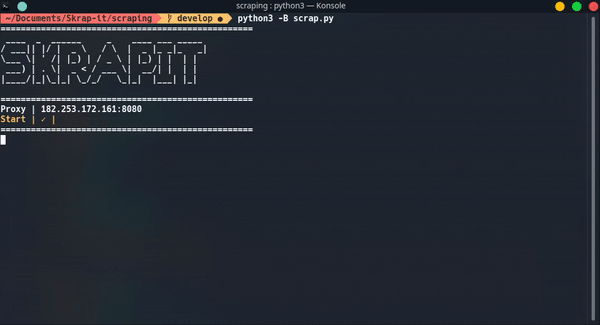
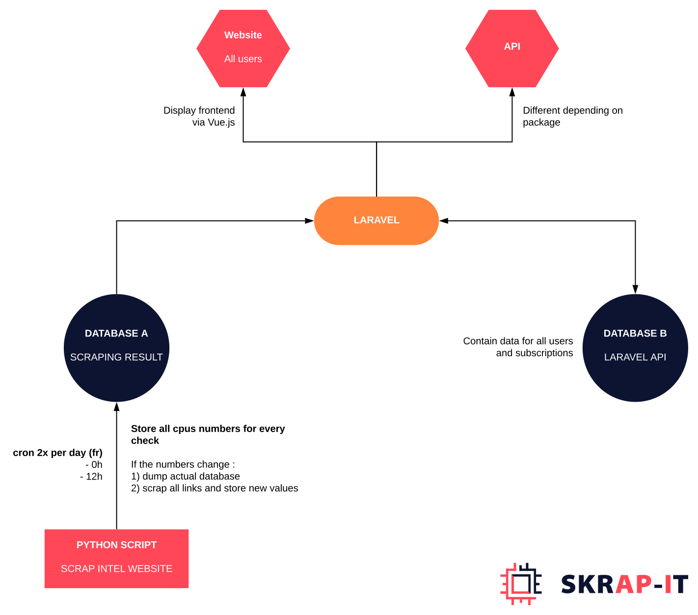
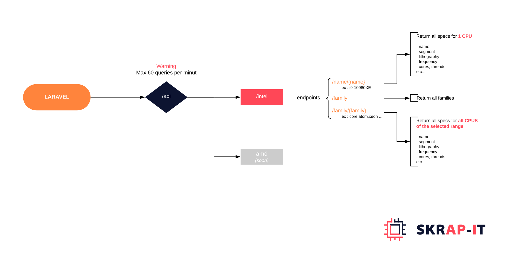
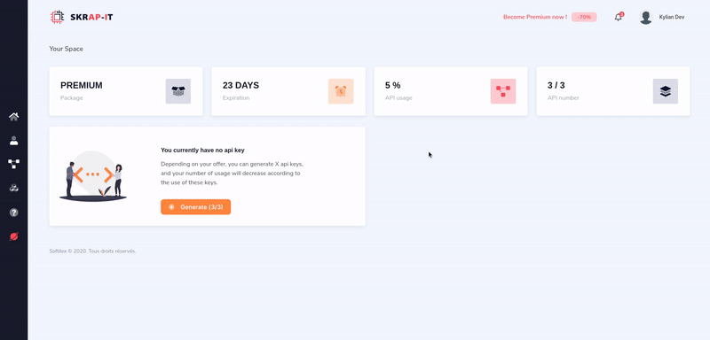

  

  <h3 align="center">Skrap-it.com</h3>

  

    All information about Intel processors, and soon AMD.
     
    <a href="#"><strong>Start with the free offer »</strong></a>
     
     
    <a href="#">View Website</a>
    ·
    <a href="#">Report Bug</a>
    ·
    <a href="#">Check Changelogs</a>
  

# Table of Contents

- [About the project](#about-the-project)
- [What is Skrap-it ?](#what-is-skrap-it-)
- [How to setup the project](#how-to-setup-the-projet)
- [Stack used](#stack-used)
- [Scraping script](#scraping-script)
- [Block diagram](#block-diagram)
- [API routes](#api-routes)
- [Some examples](#some-examples)
- [Roadmap](#roadmap)

# About The Project

## What is Skrap-it ?

We provide you with an API for all Intel branded processors.
Retrieve this information in JSON format.

We have 3 main offers, one of which is completely free.

Soon we will also add all AMD brand processors.

Our API is kept up to date constantly, and automatically updates itself according to new additions.

# How to setup the project

> You must have Docker and Python3 with pip3 on your computer

- Clone this project
- Build docker with : sudo docker-compose up --build
- Generate key : php artisan key:generate
- Fix all environment variable : .env file
- Enter in the php-fpm instance : sudo docker-compose exec php-fpm bash
- cd Skrap-it
- Install all dependencies : composer install & npm install
- Generate laravel database : php artisan migrate:all laravel
- Generate scraping database : php artisan migrate:all scraping
- (outside php-fpm) : cd scraping
- Install all python dependencies : sudo pip3 install -r requirements.txt
- Run scraping script (~ 25min) : sudo python3 -B scrap.py
- Go to this address from your web browser : http://172.28.1.1/

> If you have permissions errors : sudo chmod -R 777 Skrapit

# Stack used

We found it logical to use Python for our scrapping script, as well as Laravel as an API engine.

* Python
* Laravel
* Vue.js
* Docker
* Docker-compose
* Bootstrap
* MySQL
* Fontawesome

# Scraping script

Here is a preview of our scraping script.
It is not available in this git directory.

# Block diagram

Here is the current architecture, which will evolve as the structure evolves.

# API routes

List of currently available API routes. 

This schema will be updated for each change.

# Some examples

Preview of the dashboard, accessible when you created your account

Preview of the homepage, we serve to promote our api

# Roadmap

  Soon a trello will be available.

- [x] Scraping script
- [x] Front-end (only design)
- [x] Docker config (docker-compose)
- [x] Import Front-end
- [x] API routes
- [ ] Back-end (laravel) > in progress
- [ ] Deployment on the production server